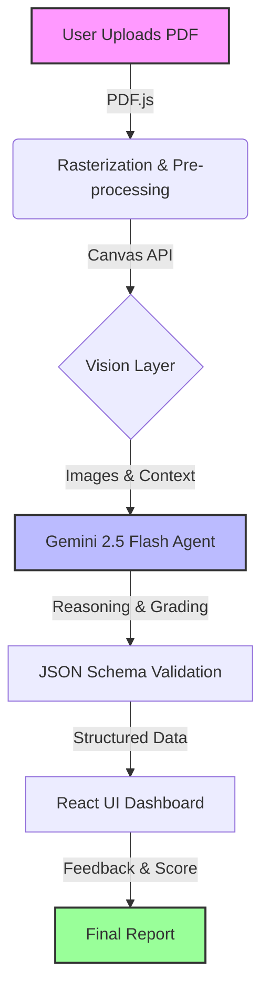

# EvalGenius 🧠✨

> **Pioneering the future of educational assessment with Agentic AI. Precision, speed, and fairness in every grade.**


## 🚀 About EvalGenius

**Grading is broken.** Educators spend countless hours manually reviewing papers, a process that is slow, prone to fatigue-induced errors, and takes time away from actual teaching.

**EvalGenius fixes this.** We have built a cutting-edge, AI-powered grading platform designed to revolutionize how educators assess student work. By leveraging advanced **multimodal AI agents**, EvalGenius can read handwritten notes, understand complex diagrams, and grade assignments with human-level precision—in seconds.

Our mission is simple: **Free educators from the burden of manual grading.**

## ✨ Key Features

### 📝 Handwritten Notes Evaluated Instantly
Gone are the days of deciphering messy handwriting. Upload answer keys and handwritten PDFs, and let our system handle the rest.
*   **Multimodal Ingestion**: Accepts PDFs, images, and scanned documents.
*   **Context-Aware**: Understands the difference between scratch work and final answers.
*   **Speed**: Grades full-length papers in under 30 seconds.


### 🤖 The Agentic Workflow
EvalGenius isn't just a wrapper around an LLM; it's a sophisticated **Agentic Workflow** that mimics the cognitive process of a human grader.
1.  **Ingestion**: The system deconstructs the document, performing pixel-perfect OCR.
2.  **Reasoning**: Agents analyze the student's logic, cross-referencing it with the rubric.
3.  **Report**: A final, detailed report is generated with actionable feedback and precise scoring.


### 👁️ Vision Layer & Deep Analysis
Our proprietary **Vision Layer** powers the core intelligence. It doesn't just "read" text; it "sees" the paper.
*   **Diagram Recognition**: Identifies and evaluates scientific diagrams, charts, and graphs.
*   **Logic Mapping**: Traces the student's steps in math and physics problems to award partial credit accurately.


*(Note: This image represents the architecture powering the vision layer)*

## 🛠️ Tech Stack

EvalGenius is built on a modern, high-performance stack designed for speed, scalability, and reliability.


-   **Frontend**: React 19, TypeScript, Vite, TailwindCSS, Framer Motion
-   **AI Core**: Google Gemini 2.5 Flash, Google GenAI SDK
-   **Document Processing**: PDF.js, Canvas API
-   **Data & Validation**: JSON Schema Validation

## 🏗️ Architecture

EvalGenius employs a serverless, client-side architecture for maximum privacy and low latency. The entire grading pipeline runs securely, leveraging the power of Gemini 2.5 for reasoning.

### System Data Flow




## 🎥 Demo

See EvalGenius in action!

<!-- GIF PLACEHOLDER 1: Add your workflow demo GIF here -->
> *[Insert Workflow Demo GIF Here]*

<!-- GIF PLACEHOLDER 2: Add your grading result GIF here -->
> *[Insert Grading Result GIF Here]*

## 🚀 Getting Started

### Prerequisites
-   Node.js (v18 or higher)
-   npm or yarn
-   Google AI Studio API Key

### Installation

1.  **Clone the repository**
    ```bash
    git clone https://github.com/yourusername/evalgenius.git
    cd evalgenius
    ```

2.  **Install dependencies**
    ```bash
    npm install
    ```

3.  **Set up Environment Variables**
    Create a `.env.local` file in the root directory and add your API key:
    ```env
    VITE_GEMINI_API_KEY=your_api_key_here
    ```

4.  **Run the development server**
    ```bash
    npm run dev
    ```

## 🤝 Contributing

Contributions are welcome! Please feel free to submit a Pull Request.

## 📄 License

This project is licensed under the MIT License.

---
<p align="center">
  Built By Ashwath ⚡
</p>
